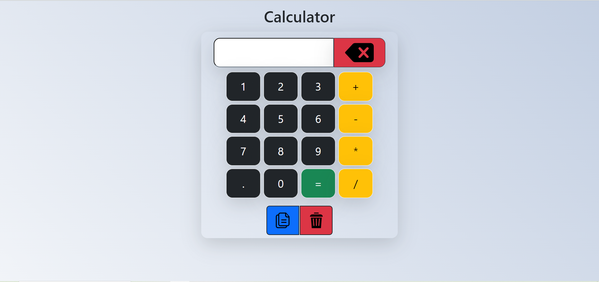
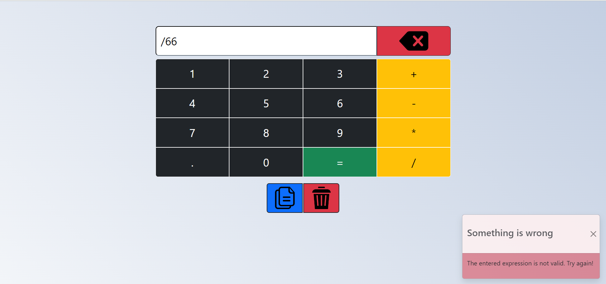

# Web-Calculator
This is a FrontEnd project without the BackEnd.

This is a calculator project on the web made with Bootstrap and a little JavaScript (for calculating and exception handling)

It is fully responsive and displays well on all devices.

Here is two pictures of project:

# Picture1

# Picture2

